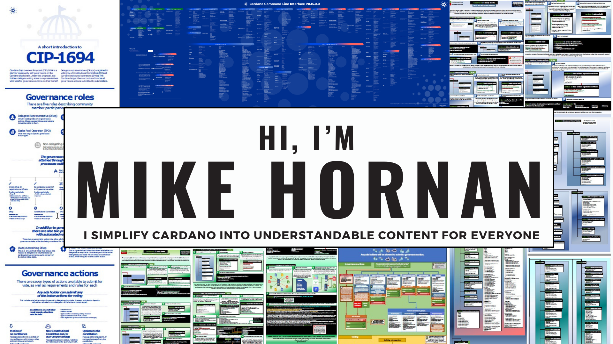

 

### Hi there 👋

I am 40 years old and father of four beautiful childrens. I am fascinated by Cardano and its governance mechanisms. I aspire to learn every technical aspect of this blockchain. I also aspire to transmit my knowledge to as many people as possible, in as many languages ​​as possible with the collaboration of other SPOs and community members. I am deeply interested in Bash, Haskell, Python, HTML, Javascript, and everything about Linux server administration.

I am a passionate infographic designer and I am always on the lookout for new projects to work on and new people to collaborate with. Do check out my repositories and feel free to reach out if you would like to work on any of my existing projects or if you think that I would be a good fit in your project.

I am the Stake Pool Operator of [ABLE Pool](https://pool.pm/dacf06a23e4aaf119024e63deb79861ca175b24e7d44d97fb92b1a22) where I actively contribute in protecting the Cardano network which is an open-source platform that seeks to provide economic identity to the billions who lack it by providing decentralized applications to manage identity, value and governance. I work in cooperation with 5 operators to ensure the proper functioning and maintenance of our servers. 

Do visit my [Twitter profile](https://twitter.com/Hornan7) where I ocassionally publish about my Cardano experiences and how this year is going to be unique for blockchain governance. 

  Projects I am currently working on:

 
 

 <h3 align="left">Connect with me:</h3>

	<a href="mailto:mike.hornan@able-pool.io" target="_blank">
		
	    <a href="https://twitter.com/Hornan7" target="_blank">
		
		

      

 
 

